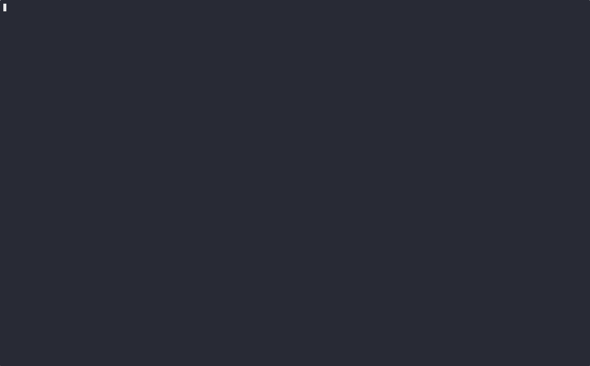

# k10s

[](LICENSE)
[](https://golang.org/)
[](https://kubernetes.io/)

🙀 A modern, pretty TUI for Kubernetes, tuned for AI Hyperscaler clusters. 

Built with Go + Bubble Tea.



## Features

- **Drill-Down Navigation**: Press `Enter` on any pod to view its containers, then drill into container logs with full text wrapping and search
- **Paginated Tables**: Browse pods, nodes, and namespaces with configurable page sizes
- **Vim Keybindings**: Navigate efficiently with `j/k`, `h/l`, `g/G`, and command mode with `:`
- **Command Mode**: Type `:` to enter command mode, then use commands like `pods`, `nodes`, `ns`, or `quit`
- **Log Viewing**: View container logs with timestamps, text wrapping (`w`), autoscroll (`s`), and fullscreen mode (`f`)
- **Customizable**: Configure page sizes and UI elements via `~/.k10s.conf`
- **Fast & Lightweight**: Built in Go with minimal dependencies

## Installation

### From Source

```bash
git clone https://github.com/shvbsle/k10s.git
cd k10s
make build
```

The binary will be available at `bin/k10s`.

### Homebrew (Coming Soon)

Once releases are published:

```bash
brew tap shvbsle/tap
brew install k10s
```

### Go install

```bash
go install github.com/shvbsle/k10s/cmd/k10s@latest
k10s
```

### Running

```bash
# Run directly
bin/k10s

# Or use make
make run
```

## Usage

### Keybindings

#### Normal Mode
- `j` or `↓`: Move down in the table
- `k` or `↑`: Move up in the table
- `h` or `←` or `PgUp`: Previous page
- `l` or `→` or `PgDown`: Next page
- `g`: Jump to top of table
- `G`: Jump to bottom of table
- `Enter`: Drill down into selected resource (pod → containers → logs)
- `Esc`: Go back to previous view
- `:`: Enter command mode
- `:quit` or `:q`: Quit k10s

#### Log View Mode
When viewing container logs:
- `w`: Toggle text wrapping
- `t`: Toggle timestamps
- `s`: Toggle autoscroll
- `f`: Toggle fullscreen mode
- `Esc`: Go back to container list

#### Command Mode
- Type a command and press `Enter` to execute
- Press `Esc` to cancel and return to normal mode

### Commands

When in command mode (press `:`), you can use:

- `pods` or `po`: Show all pods across all namespaces
- `pods <namespace>`: Show pods in specific namespace
- `nodes` or `no`: Show all nodes in the cluster
- `namespaces` or `ns`: Show all namespaces
- `services` or `svc`: Show all services
- `quit` or `q`: Exit k10s

## Configuration

k10s reads configuration from `~/.k10s.conf`. On first run, a default config file is created automatically.

### Example Configuration

```conf
# k10s configuration file
# Number of items per page in table views
page_size=20

# Pagination style: "bubbles" (dots) or "verbose" (text like "Page 1/10")
# Default: bubbles
pagination_style=bubbles

# ASCII logo (between logo_start and logo_end)
logo_start
 /\_/\
( o.o )
 > Y <
logo_end
```

### Configuration Options

- `page_size`: Number of rows to display per page (default: 20)
- `pagination_style`: Pagination display style - `bubbles` for dot-based paginator or `verbose` for text like "Page 1/10" (default: bubbles)
- `logo_start`/`logo_end`: Custom ASCII art logo to display

## Plugins

k10s features a built-in extensible plugin system that allows adding custom functionality like games, tools, or utilities. The plugin architecture is a core k10s feature designed to enable seamless integration of additional commands while maintaining isolation between plugins and the core system.

### Available Plugins

#### Kitten Climber (Built-in)

A fun infinite runner platformer game! Try typing `:play`, `:game`, or `:kitten` to launch it.

**Features**:
- Infinite procedural platform generation
- Pattern-based fish collectibles with combo system
- High score persistence (stored in `~/.k10s/plugins/kitten/highscores.json`)
- Space theme with stars
- Progressive difficulty scaling

### Adding Your Own Plugin

Plugins are compiled into k10s and implement a simple interface. Here's how to create one:

#### 1. Create Plugin Directory

```bash
mkdir -p internal/plugins/myplugin
```

#### 2. Implement the Plugin Interface

Create `internal/plugins/myplugin/myplugin.go`:

```go
package myplugin

import "github.com/shvbsle/k10s/internal/plugins"

type MyPlugin struct{}

func (p *MyPlugin) Name() string {
    return "my-plugin"
}

func (p *MyPlugin) Description() string {
    return "A description of what my plugin does"
}

func (p *MyPlugin) Commands() []string {
    return []string{"myplugin", "mp"}  // Command aliases
}

func (p *MyPlugin) Launch() error {
    // Your plugin logic here
    fmt.Println("Hello from my plugin!")
    return nil
}

func New() *MyPlugin {
    return &MyPlugin{}
}
```

#### 3. Register Your Plugin

In `cmd/k10s/main.go`, import and register your plugin:

```go
import (
    // ... existing imports ...
    "github.com/shvbsle/k10s/internal/plugins/myplugin"
)

func main() {
    // ... existing setup ...

    // Initialize plugin registry
    pluginRegistry := plugins.NewRegistry()
    pluginRegistry.Register(kitten.New())
    pluginRegistry.Register(myplugin.New())  // Add your plugin

    // ... rest of main ...
}
```

#### 4. Build and Test

```bash
make build
./bin/k10s
# Type :myplugin to launch your plugin
```

### Plugin Interface Reference

See the [`Plugin` interface definition](internal/plugins/plugin.go#L8-L23) for the complete API with documentation.

Plugins implement:
- `Name()` - Unique identifier (kebab-case)
- `Description()` - Shown in help text
- `Commands()` - Command aliases (e.g., ["play", "game"])
- `Launch()` - Execute plugin, returns to k10s on exit

### Plugin Guidelines

- **Commands**: Use short, memorable command aliases (e.g., `play`, `debug`, `tool`)
- **Error Handling**: Handle errors gracefully within your plugin
- **Dependencies**: Add any required dependencies to `go.mod`
- **Data Storage**: Store plugin data in isolated directories to avoid cross-contamination
  - Use `config.GetPluginDataDir(pluginName)` to get your plugin's data directory
  - Path format: `~/.k10s/plugins/{plugin-name}/`
  - Each plugin gets its own isolated directory automatically created
  - Example: High scores for kitten are stored in `~/.k10s/plugins/kitten/highscores.json`

### Example: TUI-based Plugin

For TUI-based plugins using Bubble Tea:

```go
func (p *MyPlugin) Launch() error {
    program := tea.NewProgram(myModel{})
    if _, err := program.Run(); err != nil {
        return fmt.Errorf("error running plugin: %w", err)
    }
    return nil  // Return to k10s after plugin exits
}
```

For more details, see [internal/plugins/README.md](internal/plugins/README.md).

## Development

### Prerequisites

- Go 1.24 or later
- Access to a Kubernetes cluster (via `~/.kube/config` or in-cluster config)

### Building

```bash
make build
```

### Running

```bash
make run
```

### Testing

```bash
make test
```

### Linting

```bash
make lint
```

### Code Formatting

```bash
make fmt
```

## Contributing

Contributions are welcome! Please feel free to submit a Pull Request.

## Releasing

See [RELEASING.md](RELEASING.md) for detailed instructions on creating releases.

## License

Apache 2.0 - see LICENSE file for details
