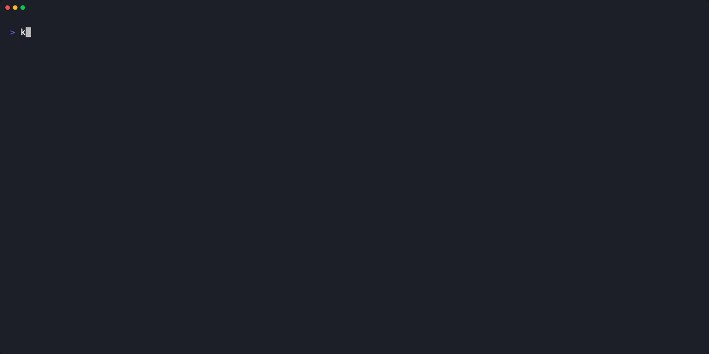

# k10s: A GPU-Aware Kubernetes Terminal Dashboard

[](LICENSE)
[](https://kubernetes.io/)
[](https://discord.gg/rngaJustFD)

**k10s** is a GPU-aware Kubernetes TUI. See which GPUs are actually doing work, which are burning money idle, and why your training job's ranks are scattered across the cluster. Vim keybindings. Single binary.

[k10s.dev](https://k10s.dev)



## Why k10s?

Most Kubernetes dashboards treat a GPU node like any other node. They have no idea an H100 costs $3/hr and is sitting at 4% utilization. k10s closes that gap.

- **GPUs and jobs are the atoms, not pods.** The default view is a fleet-level GPU dashboard with per-node utilization bars, memory, temperature, power draw, and workload attribution. Pods are an implementation detail you drill into when needed.
- **Idle GPUs are loud, not quiet.** Idle nodes sort to the top and glow amber. An unallocated H100 is $3/hr on fire. k10s makes that impossible to miss.
- **Training job awareness.** Group pods by `Job`, `JobSet`, `RayJob`, `PyTorchJob`, or `MPIJob`. See rank status, gang-scheduling state, and restart counts as one logical unit instead of 64 unrelated pods.
- **Drill-down, not sprawl.** Fleet > node > GPU > workload. Enter drills in, Esc goes back. Dedicated keys for context-filtered jumps: workloads (`w`), events (`e`), jobs (`g`).
- **Works without DCGM.** GPU count and workload mapping come from the k8s API. Install DCGM exporter for live utilization, memory, temp, and power. k10s degrades gracefully without it.

## Roadmap

- [ ] Fleet view as default landing screen: per-node GPU count, utilization bars, workload attribution, idle detection from k8s API
- [ ] Loud-idle visual treatment: amber highlight for idle nodes, sorted to top by idle duration
- [ ] Node detail view: Enter on a node drills into per-GPU breakdown (index, utilization, memory, temp, power, workload, training rank)
- [ ] DCGM exporter integration: scrape Prometheus metrics for live GPU utilization, memory, temperature, and power; degrade gracefully without it
- [ ] Jobs view: group pods by parent training CRD (`Job`/`JobSet`/`RayJob`/`PyTorchJob`/`MPIJob`), show rank counts, status, restarts, Kueue queue
- [ ] Context-filtered jumps: `w` for workloads, `e` for events, `g` for jobs, all scoped to the current node
- [ ] Kueue queue integration: admission state, queue depth, pending workload visibility
- [ ] "Why is this GPU idle?" diagnostic: rule-based explanation of taint mismatches, resource fit, affinity, scheduling failures, PDB blocks

## Installation

### macOS (Homebrew)

```bash
brew tap shvbsle/tap
brew install k10s
```

### Go Install

```bash
go install github.com/shvbsle/k10s/cmd/k10s@latest
```

Then run:

```bash
k10s
```

## Usage

### Keybindings

#### Fleet / Table Views
- `j` / `↓`: Move down
- `k` / `↑`: Move up
- `h` / `←` / `PgUp`: Previous page
- `l` / `→` / `PgDown`: Next page
- `g`: Jump to top
- `G`: Jump to bottom
- `Enter`: Drill down (fleet → node detail → GPU → workload)
- `Esc`: Go back one level
- `w`: Workloads view, filtered to current node
- `e`: Events view, filtered to current node
- `:`: Enter command mode

#### Log View
- `w`: Toggle text wrapping
- `t`: Toggle timestamps
- `s`: Toggle autoscroll
- `f`: Toggle fullscreen
- `Esc`: Back to previous view

### Commands

Press `:` to enter command mode:

- `pods` or `po`: All pods (all namespaces)
- `pods <namespace>`: Pods in a specific namespace
- `nodes` or `no`: All nodes
- `namespaces` or `ns`: All namespaces
- `services` or `svc`: All services
- `jobs`: Training jobs view
- `quit` or `q`: Exit

## Development

### Prerequisites

- Access to a Kubernetes cluster (via `~/.kube/config`)

```bash
make build    # Build
make run      # Run
make test     # Test
make lint     # Lint
make fmt      # Format
```

## Contributing

Contributions are welcome. Check the [roadmap](roadmap.md) for planned work.

## Community

[](https://discord.gg/rngaJustFD)

**Discord:** [https://discord.gg/rngaJustFD](https://discord.gg/rngaJustFD)

## License

Apache 2.0. See [LICENSE](LICENSE) for details.
